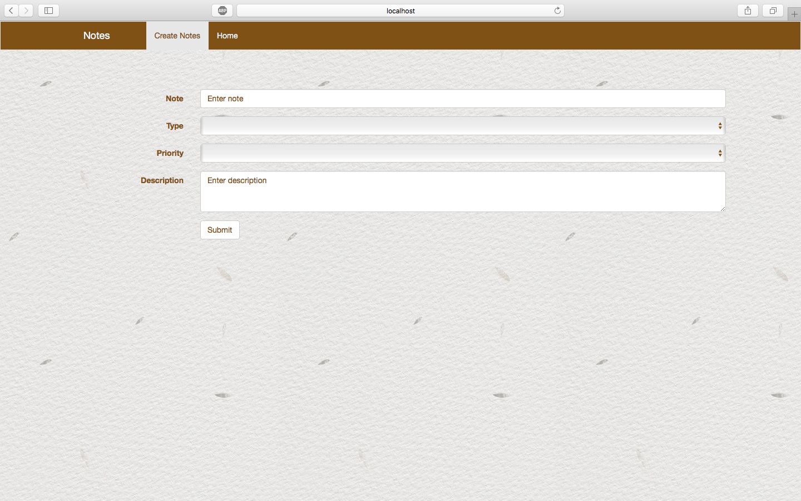
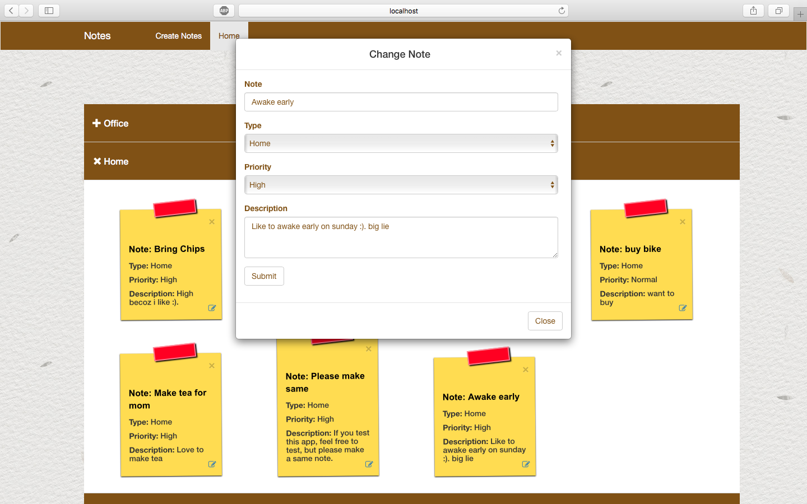
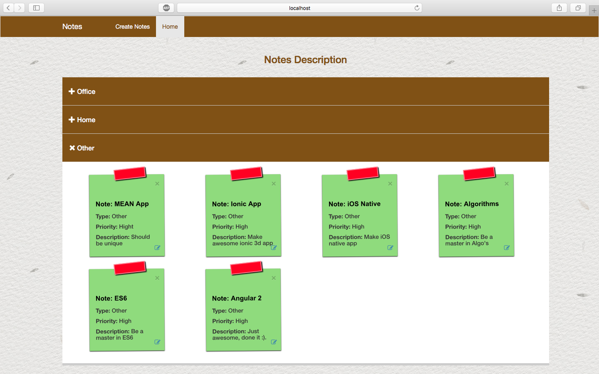

# MEAN-Notes-App

User can create notes for office, home and other stuff.

I created this app from scratch using MEAN stack. It works on real time without using socket.io. I made some code duplication on some places to get
this desire effect. In my other project i performed same operation using
local storage. 

## Build 

npm install  

nodemon server.js

# How to use

Create note it will take the user to the home page, where user can see notes according to their types.

# Result

 

